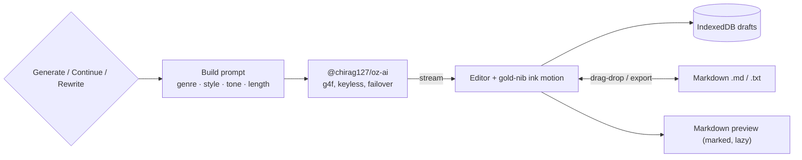

# oriz-muse

> Free AI writing studio in your browser — generate, continue, and rewrite prose. 100% client-side.

[](./LICENSE)
[](https://github.com/chirag127/oriz-muse/stargazers)
[](https://github.com/chirag127/oriz-muse/commits/main)
[](https://astro.build)


- **Live app:** https://muse.oriz.in _(canonical — Cloudflare Pages)_
- **About / info:** https://chirag127.github.io/oriz-muse/ _(GitHub Pages landing)_
- **Repo:** https://github.com/chirag127/oriz-muse
- **llms.txt:** https://muse.oriz.in/llms.txt

Free AI writing studio in your browser — generate stories, poems, lyrics, blog posts, essays, and screenplays; continue an existing draft in your own voice; or rewrite any passage in a chosen style and tone.

**100% client-side, no upload, no signup, free.** Every keystroke and every draft stays in your browser (IndexedDB). AI runs through [`@chirag127/oz-ai`](https://github.com/chirag127/oz-ai) (wraps g4f / gpt4free with multi-provider failover), so it works without an API key — and if every provider is down, your text is untouched and you keep writing by hand.

**⭐ If this is useful, please [star the repo](https://github.com/chirag127/oriz-muse/stargazers) — it helps others find it.**

## How it works



## What it does

- **Generate** — pick a genre (story / poem / lyrics / blog / essay / screenplay), seed a topic, tune style, tone, and length.
- **Continue** — hand the pen to the muse; it matches your voice, tense, and style and adds what comes next.
- **Rewrite** — recast any passage into a different style (Noir, Gothic, Hemingway, Shakespearean, ...) and tone.
- **Prompt library** — curated starter prompts per genre, one click to load.
- **Drafts** — save, reload, and delete drafts stored only on this device.
- **Preview** — Markdown preview (lazy-loaded `marked`).
- **Import / export** — drag-drop a `.md` / `.txt` to load, export your work as Markdown.
- **Streaming** — text streams in with a signature gold-nib ink-flow motion.

## Tech

Client-only Astro static site with React 19 islands and Tailwind v4. AI via `@chirag127/oz-ai` (g4f / gpt4free, keyless, multi-provider failover). Markdown via `marked` (lazy). Drafts in IndexedDB. PWA-installable. No backend, no accounts, no analytics.

## Develop

```bash
npm install --legacy-peer-deps
npm run dev       # local dev
npm test          # vitest — pure logic
npm run build     # static build -> dist/
npm run deploy    # build + wrangler pages deploy
```

> Windows: use **npm**, not pnpm (pnpm skips `@esbuild/win32-x64` -> the Astro build crashes).

## Two surfaces

- **Live app** (Cloudflare Pages) — the writing studio at https://muse.oriz.in
- **Info page** (GitHub Pages) — a separate "about this project" page at https://chirag127.github.io/oriz-muse/, published from `gh-info/` by `.github/workflows/gh-pages-info.yml`.

## Part of the oriz family

One of ~80 small, fast, single-purpose tools and sites in the **oriz** fleet — see [blog.oriz.in](https://blog.oriz.in) for how it's built and run solo. Sibling tools: [persona.oriz.in](https://persona.oriz.in) · [quiz.oriz.in](https://quiz.oriz.in) · [json.oriz.in](https://json.oriz.in) · [name.oriz.in](https://name.oriz.in).

**Cost:** $0 — static build hosted free on Cloudflare Pages; AI is keyless (g4f) and client-side.

## Contributing

Issues and PRs welcome. Conventional commits are the changelog.

## Author

Chirag Singhal · chirag@oriz.in

## Status

Stable.

## License

MIT (c) 2026 Chirag Singhal
