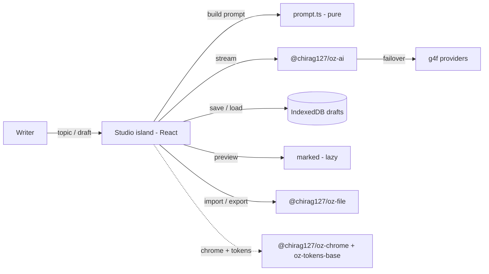

# oriz-muse

**Live: https://muse.oriz.in**

A romantic writing atelier in your browser. Generate stories, poems, lyrics, blogs, essays, and screenplays; continue an existing draft; rewrite a passage in a chosen style; keep a prompt library; and save drafts.

**100% client-side — no upload, no signup, no key.** Every keystroke and every draft stays in your browser (IndexedDB). AI runs through [`@chirag127/oz-ai`](https://github.com/chirag127/design-system) (wraps g4f / gpt4free with multi-provider failover), so it works without an API key — and if every provider is down, your text is untouched and you keep writing by hand.


## What it does

- **Generate** — pick a genre (story / poem / lyrics / blog / essay / screenplay), seed a topic, tune style, tone, and length.
- **Continue** — hand the pen to the muse; it matches your voice, tense, and style and adds what comes next.
- **Rewrite** — recast any passage into a different style (Noir, Gothic, Hemingway, Shakespearean, …) and tone.
- **Prompt library** — curated starter prompts per genre, one click to load.
- **Drafts** — save, reload, and delete drafts stored only on this device.
- **Preview** — Markdown preview (lazy-loaded `marked`).
- **Import / export** — drag-drop a `.md` / `.txt` to load, export your work as Markdown.
- **Streaming** — text streams in with a signature gold-nib ink-flow motion.

## Design

Bespoke "romantic atelier" identity: ink + blush + gold-leaf on paper-grain, flowing serif display (Cormorant + EB Garamond), a poet's writing-desk layout, and a quill ink-flow signature as text streams in. WCAG-AA contrast, responsive (390px → 1440px), dark-mode aware.

## Architecture



## Stack

Astro (static) · React 19 islands · Tailwind v4 (`@tailwindcss/vite`) · `@astrojs/sitemap` · shared `@chirag127/oz-*` packages · `marked` · IndexedDB.

## Develop

```bash
npm install --legacy-peer-deps
npm run dev       # local dev
npm test          # vitest — pure logic
npm run build     # static build → dist/
npm run deploy    # build + wrangler pages deploy
```

> Windows: use **npm**, not pnpm (pnpm skips `@esbuild/win32-x64` → the Astro build crashes).

## Privacy

No backend. No accounts. No analytics. Prompts go directly from your browser to the g4f provider chain; drafts never leave your device.

## License

MIT © 2026 Chirag Singhal
